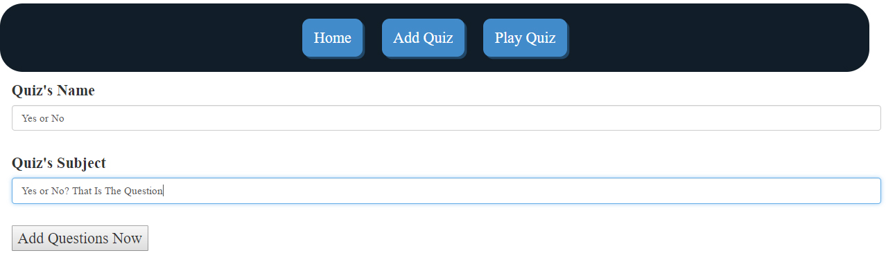
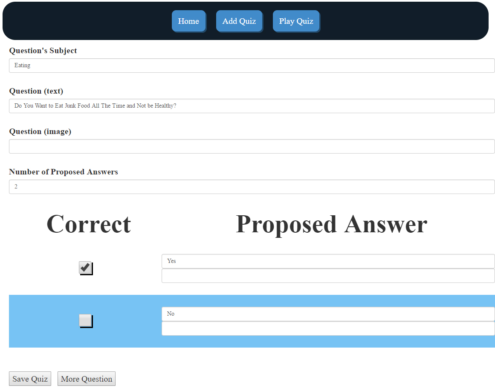
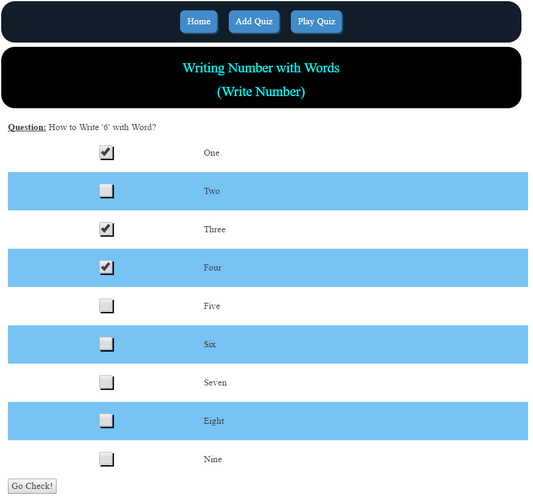

# QUIZ: 5 - MEAN Stack - Quiz

## Aim: **MongoDB**, **ExpressJS**, **Angular 2** and **NodeJS** (**M.E.A.N**).

To build a program that execute customized-quiz: "**memorization**", "**flashcard**", "**true/false**", "**multiple choice questions**") everything is controlled totally by a **Graphic User Interface**.

The structure is a full "**3-tier Architecture**" with a **MVC**'s model.

**Goal**: learn how to create - dynamically or statically - object (**button**, **radio**, **form**, etc.) and how to handle them.

## Technologies
As we start with the same problem (**quiz**), all application of the series show about the same things. However, the goal is to focus on the use of technologies.
 
## Execution
1. Execute "**npm install**" to install dependencies. **Attention:** my computer with 12 GB of RAM is not enough to install the dependencies: the installation's process stops before the end and we have a "**node_modules/.staging**" folder instead of dependencies' folders. It installs perfectly with a machine with 16 GB of RAM. Why? No Idea ...
2. No need to start a database server: we are using an online MongoDB: "**mLab**"
3. Enter "**npm run build**" to compile TypeScript's files and run the server ...

Open a browser and enter: "**localhost:3000**" or "**localhost:3000/add**" or "**localhost:3000/play**" (we are using Routing, so, not really a Single Page Application - with its advantages and its disadvantages - anymore. Routing offers more possibilities ...) 

## UI

### Build New Quiz: Add General Information

------

### Build New Quiz: Setup Proposed Answers

------

### Play Quiz: Give Answers

------

### Play Quiz: Check Answers

## Limitation
We need to manage **lifecycle** of each connection: each user should have his (her) own test so they could "**play**" at the same time (which, with this version, we could not do it). However, it should be easy to fix: create **class/object** for each user and put them into a sort of **pool**.

## Evolution
* It's better to use "online" database (**mLab**, **Firebase**, **AWS**, etc.) as a datasource. So, we don't need to run the database (**MongoDB** in this case) before to be able to used the application. To develope and **Mobile App**, the "online" database is crucial!
* **Short term** (very easy but need time): have selection of quizzes, mix them, complete **CRUD** operations. Use **Angular** and/or **ReactJS** for the **view**.
* **Long term**: add **tests** into a global structure (we could use the **Dewey Decimal Classification**) so we could have all sort of data about each subject (mostly for personal use so we could centralize all acknowledge in a same place): 
	- **documents**
	- **tests**
	- **videos**
	- etc.

## Author
* Dinh HUYNH - All Rights Reserved!
* dinh.hu19@yahoo.com
